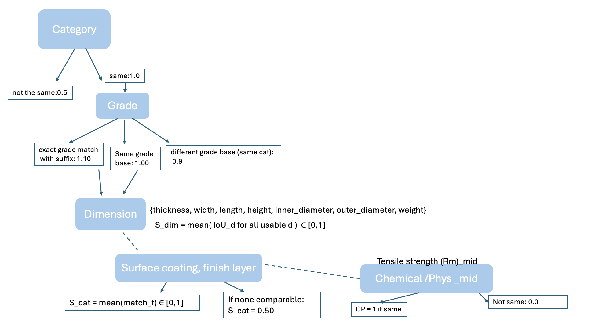

# Vanilla Steel Assignment

## Structure of the repository

```
├─ task_1/ 
│  ├─  supplier_data1.xlsx
│  └─ supplier_data2.xlsx
├─ task_2/ 
│  ├─ reference_properties.tsv
│  └─ rfq.csv
├─ plots/
│   └─ decision_comparison_tree.png
├─ deliverables/
│   └─ inventory_dataset.csv
│   └─ top3.csv
├─ ablation_out/ -> additional task, ablation results
├─ TaskA.ipynb
├─ TaskB.ipynb
├─ TaskB_ablation.ipynb 
├─ README.md
└─ requirements.txt
```

## Creation of venv

```bash
python3 -m venv dataenv
source dataenv/bin/activate
pip install -r requirements.txt
```

Select this venv for kernel for both notebooks.

## Task A.1 — Clean & Join
Goal:
- Clean and normalize both datasets (e.g., unify thickness/width formats, standardize names).
- Handle missing/inconsistent values.
- Join into a single table called inventory_dataset.
- Document your assumptions.

Deliverable: inventory_dataset.csv

**TaskA.ipynb**
- **Datasets loaded:** `task_1/supplier_data1.xlsx` and `task_1/supplier_data2.xlsx` (50 rows each). Initial `info()` showed no NaNs, but several numeric fields contained zeros that behave like missing values.
- **Column normalization:** Renamed columns to snake_case and aligned semantics across files.
  - Supplier 1 mapping: `Quality/Choice→quality_choice`, `Grade→grade`, `Finish→finish`, `Thickness (mm)→thickness_mm`, `Width (mm)→width_mm`, `Description→defect_desc`, `Gross weight (kg)→sup1_weight_kg`, `RP02→rp02`, `RM→rm`, `Quantity→sup1_quantity`, `AG→ag`, `AI→ai`.
  - Supplier 2 mapping: `Material→material`, `Description→coating_desc`, `Article ID→article_id`, `Weight (kg)→sup2_weight_kg`, `Quantity→sup2_quantity`, `Reserved→reserved`.
  - Additional cleanup for Supplier 2: extracted final token of `coating_desc` and lowercased (oiled/painted/not), normalized `reserved` to lowercase with underscores.
- **Missing-value analysis (zeros as proxies):**
  - Found substantial zeros in `sup1_quantity` and `ag`, and notable zeros in `rp02` and `rm`.
  - Identified 15 rows where `sup1_quantity == 0` but `sup1_weight_kg > 0` (a quantity/weight inconsistency). Computed a `quantity_weight_conflict` flag for these.
  - Explored associations: numeric–numeric correlations were weak; categorical–numeric (eta-squared) and categorical–categorical (Cramér’s V) also weak, suggesting limited structure given small sample size.
  - Computed `unit_weight = sup1_weight_kg / sup1_quantity` for rows with `sup1_quantity > 0`. Distribution is wide; ANOVA by `grade` and `finish` showed no significant differences (p > 0.2), reinforcing weak group effects.
- **Imputation approach (applied to Supplier 1 during exploration):**
  - Imputed `sup1_quantity` for `quantity_weight_conflict` rows using median `unit_weight` by `(grade, finish)`, falling back to grade-only median, then global median.
  - Converted exact zeros in mechanical properties (`rp02`, `rm`, `ag`) to NaN prior to any imputation logic; considered defect-aware handling for “Sollmasse (Gewicht) unterschritten”.
- **Join decision:** No reliable natural key exists across the two files. Overlapping fields ( weights, quantities) are not unique identifiers, and `Description` has different semantics in each dataset. Therefore, no merge was performed. Instead, both tables were column-aligned and concatenated to produce a unified inventory table, saved as `deliverables/inventory_dataset.csv`.

## Task B — Normalize, Join, and Similarity Scoring
- **Goal:** Normalize RFQ grades, parse reference properties, left‑join RFQs to reference by grade, engineer comparable features, and compute top‑3 similar matches per RFQ.
- **Inputs:** `task_2/rfq.csv`, `task_2/reference_properties.tsv`

**TasksB.ipynb**
- **TaskB.1**:
    - **Grade normalization:**
        - Standardized case and reconciled minor variants (`HC380LA` vs `HC380La`).
        - Parsed `grade` into `grade_base` + `grade_suffix` to support tiered matching.
    - **Reference parsing:**
        - Cleaned textual ranges ("≤", "min‑max") into numeric `_min`, `_max`, and `_mid` fields for chemistry/mechanical properties where feasible.
    - **Join:**
        - Left join RFQs to reference on normalized `grade` (no imputations). Missing RFQ grades remain unmatched (59 rows noted); no valid‑grade rows lacked a reference match in the sample.
- **Task B.2 Feature engineering:** 
    - Built interval columns from dimension pairs like `thickness_min/_max`, `width_min/_max`; condensed to `[min, max]` tuples.
    - Defined dimension similarity via IoU (intersection over union).
    - Categorical similarity - binary matches on `coating`, `finish`, `surface_type`, `surface_protection`.
- **Task B.3 Scoring and ranking:**
    - IoU across all comparable intervals ->`S_dim`
    - Mean across categorical binary matches on `coating`, `finish`, `surface_type`, `surface_protection`, `form`  -> `S_cat`
    - Property proximity -> `CP` ( compares `tensile_strength_mid` within ±10% (1 if within, 0 if outside, 0.30 if missing on either side))

  - Multipliers: `CategoryMultiplier` (strict or penalized fallback) × `GradeTierMultiplier` (exact grade+suffix=1.00; same base=0.95; different base=0.85).
  - Final score: `Final = Multiplier × (0.60·S_dim + 0.30·S_cat + 0.10·CP)`; always in [0,1].
  - Implemented in `utils/similarity_score.py` (function `top3_for_all`).
  - Output top‑3 per RFQ to `deliverables/top3.csv`.
  - Ablation: configurable weights/multipliers via `DEFAULT_CONFIG` and helpers `run_topk_with_config`, `compare_topk`; see `TaskB_ablation.ipynb`. Summary saved to `deliverables/ablation_summary.csv`.


**Assumptions/Notes**
- No imputation in Task B; missing values are preserved and handled within the scoring logic.
- Joining key is the normalized `grade`; suffix variants are handled via `grade_base`/`grade_suffix`.
- The scoring balances dimensions, categorical context, and mechanical proximity with transparent weights.


**Ablation Analysis - TaskB_ablation**
- **Approach:** Run multiple scoring configs (dimensions-only, categorical-only, CP-only, grade-dominant), compute top‑k per RFQ, then compare each variant to baseline using Jaccard@k overlap, top‑1 change rate, average rank shift, and added/removed candidates.
- **Some results:**
  - `grade_dom`: highest stability (mean Jaccard@3 ≈ 0.699; top‑1 changes ≈ 18.7%), showing grade multipliers strongly anchor rankings.
  - `dims_only`: solid signal from dimensions (J@3 ≈ 0.642; top‑1 changes ≈ 24.7%).
  - `cp_only`: moderate impact (J@3 ≈ 0.515; top‑1 changes ≈ 34.6%).
  - `cat_only`: least stable (J@3 ≈ 0.418; top‑1 changes ≈ 47.7%), indicating categorical matches alone are weak drivers.
  - Overall: dimensions and grade tiering carry most of the discriminative power; categorical fields and CP add nuance but are weaker alone.

